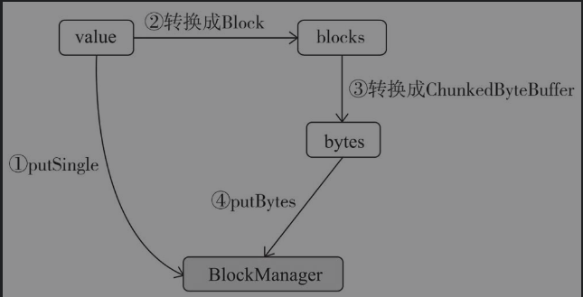
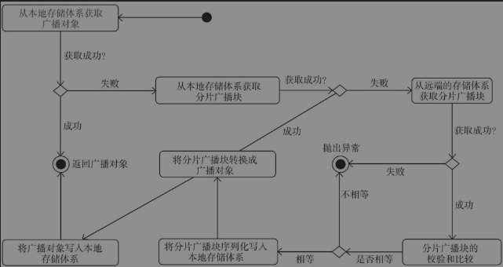

> 专栏原创出处：[github-源笔记文件 ](https://github.com/GourdErwa/review-notes/tree/master/framework/spark-basis)

[[toc]]
## 简介
### Spark 的身世
Spark 是一个通用的并行计算框架，由加州伯克利大学（UC Berkeley）的 AMP 实验室开发于 2009 年，并于 2010 年开源，
2013 年成长为 Apache 旗下在大数据领域最活跃的开源项目之一。目前 Spark 的版本已经更新到了 2.4.4，并且预上线了 3.0 版本，
相信未来会有更精彩的地方值得我们期待
### Spark 的优势
* 采用先进的 DAG 调度程序，查询优化器和物理执行引擎，实现了批处理和流数据处理的高性能，比 Hadoop 的 Map-Reduce 计算速度提升了很多倍。
* 支持多种变成语言，比如：Java、Scala、Sql、Python、R。
* 提供了 80 多个高级操作符，可以轻松构建并行应用程序，并且可以在 Scala、Python、R 和 SQL shell 中交互式地使用它。
* 提供了一套完善的生态体系，包含 Sql、DataFrame、MLlib、GraphX 和 SparkStreaming，可以在同一个应用程序中无缝的组合使用他们。
* 支持单机、YARN、Mesos 等多种部署方式，并且支持丰富的数据源和文件格式的读取
### Spark 针对 MR 做的改进
1. 减少了磁盘的 I/O，Spark 将 map 端的中间输出和结果存储在内存中，避免了 reduce 端在拉取 map 端数据的时候造成大量的磁盘 I/O；并且 Spark 将应用程序上传的资源文件缓冲到了 Driver 端本地文件服务的内存中，Executor 在执行任务时直接从 Driver 的内存中读取，也节省了一部分磁盘的 I/O。
2. 增加了并行度，由于将中间结果写到磁盘与从磁盘读取中间结果属于不同的环节，Hadoop 将它们简单地通过串行执行衔接起来。Spark 把不同的环节抽象为 Stage，允许多个 Stage 既可以串行执行，又可以并行执行。
3. 避免重新计算，当某个 Stage 中的一个 Task 失败之后，Spark 会重新对这个 Stage 进行调度，并且会过滤掉已经执行成功的 Task，避免造成重复的计算和资源的浪费。
4. 可选的 Shuffle 排序，MR 在 Shuffle 的时候有着固定的排序操作，但是 Spark 却可以根据不用的场景选择在 map 端排序还是在 reduce 端排序。
5. 更加灵活的内存管理， Spark 将内存划分为堆内存储内存、堆内执行内存、堆外存储内存和堆外执行内存。Spark 即提供了执行内存和存储内存之间固定边界的实现，也提供了执行内存和存储内存之间"软"边界的实现。Spark 默认使用第二种实现方式，无论存储或是执行内存，当哪一方的资源不足时，都可以借用另一方的资源，从而最大限度地提高了资源的利用率。

## 核心组件
### SparkContext
SparkContext 是 Spark 各种功能的主要入口点，表示和 Spark 集群的一种连接，它可以为这个集群创建 RDD、累加器、广播变量等等。
* 一个 JVM 环境下只能有一个活跃的 SparkContext，你可以通过调用 `stop()` 方法，停掉活跃的 SparkContext 来创建新的，这种限定在将来可能会被废弃。
* 重要组成：SparkEnv、SparkUI、LiveListenerBus、SparkStatusTracker、ConsoleProgressBar、JobProgressListener、TaskScheduler、DAGScheduler、HeartBeatReceiver、ContextCleaner、ShutdownHookManager。
> 通过 SparkContext.getOrCreate(conf : SparkConf) 可以创建一个 SparkContext
### SparkConf
Spark 支持各种各样的配置参数来调整任务的运行，SparkConf 是统一管理这些配置的一个配置类，所有的配置项都由 SparkConf 来进行管理。
* 所有的配置都保存在一个 `ConcurrentHashMap[String,String]` 中，因此配置 SparkConf 时，无论是 key 还是 value 都是 String 类型的。
* 通过调用 `set(key: String, value: String)` 方法来给 Spark 设置参数，类似 setMaster() 的方法，内部也是调用了 set() 方法进行参数配置。
* 在创建 SparkConf 的时候，可以指定一个 Boolean 类型的构造器属性 loadDefaults，当设置为 true 时，会从系统属性中加载以 spark. 字符串为前缀的 key 值，并调用 set() 方法进行赋值。
* 由于 SparkConf 继承了 Cloneable 特质并实现了 clone 方法，虽然 ConcurrentHashMap 是线程安全的，但是在高并发的情况下，锁机制可能会带来性能上的问题，因此当多个组件共用 SparkConf 的时候，可以通过 clone 方法来创建出多个 SparkConf。
###  SparkEnv
是 Spark 运行时的环境对象，其中包含了 Executor 执行任务时需要的各种对象，例如 RpcEnv、ShuffleManager、BroadcastManager、BlockManager 等，用来管理节点之间的通信、数据的 shuffle、内存空间、数据的计算存储等，所有的 Executor 都持有自己的 SparkEnv 环境对象。此外，在 local 模式下，Driver 会创建 Executor，所以在 Driver 和 CoarseGrainedExecutorBackend 进行中都有 SparkEnv 的存在。
* SparkEnv 不是为了提供给外部使用的，有可能会在将来的版本变为私有。
### Driver
Spark 任务运行调度的核心，负责创建 SparkContext 上下文环境，内部包含 DAGScheduler、TaskScheduler、SchedulerBackend 等重要组件。  
* 负责向 Master 注册当前应用程序并申请计算资源，注册成功后 Master 会为其分配申请的资源。
* 负责切分任务，并将 Task 分发到不同的 Executor 上执行。
* 与 Executor 保持通信，任务运行成功或是失败都会向 Driver 进行汇报，当任务执行完成之后，Driver 会关闭 SparkContext。
### DAG
有向无环图，在 Spark 中对 RDD 的操作分为两种，一种是 transformation 的，另一种是 action 的，当不断的对 RDD 使用 transformation 算子时，会不断的生成新的 RDD，这些 RDD 之间是存在 ' 血缘关系 ' 的，因此也被称为 lineage，直到触发了 action 动作的算子之后，整个 DAG 图就结束了。
* DAG 的具体实现在 DAGScheduler 中。
### Stage
当 RDD 触发了 action 算子之后，DAGScheduler 会开始分析最终 RDD 形成的依赖关系，逆向往前推导，前一个 RDD 被看做是父 RDD。在 Spark 中 RDD 之间的依赖关系存在两种情况，一种是 ' 窄依赖 ' 一种是 ' 宽依赖 '，每当遇到一个宽依赖的时候，便会以此为分界线，划分出一个 Stage
* 窄依赖：父 RDD 中每个分区的数据只由子 RDD 的一个分区使用。
* 宽依赖：父 RDD 中一个分区的数据被多个子 RDD 的分区使用。
* Stage 分为两种，最后一个 Stage 之前的全部是 ShuffleMapStage，最后一个 Stage 是 ResultStage。
### Task
Task 是任务真正的执行者，每个 Stage 会根据 Partition 的数量生成 Task，一个 Stage 中的 Task 最终会包装成一个 TaskSet 传给 TaskScheduler。
* 每个 Stage 中，一个 Partition 对应一个 Task。
* Task 分为两种，一种是 ShuffleMapTask，另一种是 ResultTask。
### DAGScheduler
DAGScheduler 是一个高层次的调度器，负责将 DAG 有向无环图划分成不同的 Stage，划分的依据即为 RDD 之间的宽窄依赖，划分完成之后，构建这些 Stage 之间的父子关系，最后将每个 Stage 按照 Partition 切分成多个 Task，并且以 TaskSet 的形式提交给 TaskScheduler。
### TaskScheduler
TaskScheduler 接收 DAGScheduler 提交过来的 TaskSet 集合，并向 Driver 请求分配任务运行资源，Driver 将可用的 ExecutorBackend 资源发给 TaskScheduler，TaskScheduler 将 Task 合理的分配给所有的 ExecutorBackend，最后会向 ExecutorBackend 发送 launchTask 请求，这时 Executor 会启动 TaskRunner 线程并放到线程池中执行任务。
* TaskScheduler 通过 SchedulerBackend 来给 Task 分配资源，并与相应的 Executor 进行通信，让其运行任务。
### Master
Master 是在 local 和 standalone 模式部署下 Spark 集群的一名重要成员，它负责管理整个集群中所有资源的分配，接收 Worker、Driver、Application 的注册，Master 会获得所有已经注册的 Worker 节点的资源信息 (包括：ID、host、port、cpu、memory 等等)。
* 为了保证集群的高可用，可以同时启动多个 Master，但是这些 Master 只有一个是 Active 状态的，其余的全部为 Standby 状态。Master 实现了 `LeaderElectable` 接口，当有 Master 发生故障时，会通过 `electedLeader()` 方法选举新的 Master 领导。
* Master 会按照一定的资源调度策略将 Worker 上的资源分配给 Driver 或者 Application。
* Master 给 Driver 分配了资源以后，会向 Worker 发送启动 Driver 的命令，Worker 接收到命令后启动 Driver。
* Master 根据 Application 申请的资源，选择合适的 Worker 进行资源分配，然后会向 Worker 发送启动 Executor 的命令，Worker 接到命令后启动 Executor。
* Master 会和 Worker 保持心跳连接，一是检查 Worker 的存活状态；二是当 Master 出现故障后选举了新的 Master，新的 Master 中并没有保存 Worker 的信息，当 Worker 向 Master 发送心跳的时候，Master 会通知 Worker 重新向新的 Master 进行注册。
### Worker
Worker 是组成 Spark 集群的成员之一，启动之后会主动向 Master 进行注册，负责向 Master 汇报自身所管理的资源信息，当接到 Master 的命令之后，启动相应的 Driver 或者 Executor。Worker 启动之后会自动的向 Master 进行注册，因此可以动态的扩展 Worker 节点。
* Worker 向 Master 注册成功之后，会以 HEART-BEAT_MILLIS 作为间隔向 Worker 自身发送 SendHeartbeat 消息的定时任务。
* Worker 接收到 SendHeartbeat 消息后，将向 Master 发送 Heartbeat 消息。
* Master 也会以 WORKER_TIME-OUT_MS 为时间间隔定时向 Master 自身发送 CheckForWorkerTimeOut 消息，用来检查连接超时的 Worker。
* 如果 Master 发现了连接超时的 Worker，但是 Worker 的状态并不是 DEAD，此时 Master 会将 Worker 的信息从 idToWorker 中移除，但是 workers 中任然保留着 Worker 的信息，并且会再次向 Worker 发出重新注册的信息。
* 如果 Master 发现了连接超时的 Worker，并且 Worker 的状态并是 DEAD，那么 Worker 的信息将会从 workers 中被移除。
### Executor
是负责执行 Spark 任务的一个容器，在 Worker 上启动，通过 `launchTask()` 方法创建 TaskRunner 执行任务，会和 Driver 建立通信，将最后执行的结果发送给 Driver。

## Spark 执行环境
Spark 对任务的计算都依托于 Executor 的能力，所有的 Executor 都会有自己的执行环境 SparkEnv，具备了这个能力就可以将数据存储在存储体系中，就可以利用计算引擎对任务进行处理，以及在节点之间相互通信等等。因此 SparkEnv 是非常重要的一个组件，它同样提供了多种多样的内部组件对应实现相应的功能。
```scala
{
  // SparkEnv 的定义，可以看到初始化 SparkEnv 时需要的各种组件。
  class SparkEnv (
      val executorId: String,
      private[spark] val rpcEnv: RpcEnv,
      val serializer: Serializer,
      val closureSerializer: Serializer,
      val serializerManager: SerializerManager,
      val mapOutputTracker: MapOutputTracker,
      val shuffleManager: ShuffleManager,
      val broadcastManager: BroadcastManager,
      val blockManager: BlockManager,
      val securityManager: SecurityManager,
      val metricsSystem: MetricsSystem,
      val memoryManager: MemoryManager,
      val outputCommitCoordinator: OutputCommitCoordinator,
      val conf: SparkConf) extends Logging {...}
}
```
### 序列化管理器 SerializerManager
Spark 中很多对象在通过网络传输或者写入存储体系时，都需要序列化。SparkEnv 中有两个序列化的组件，分别是 SerializerManager 和 closureSerializer。
* SparkEnv 中初始化的 serializer 默认采用 JavaSerializer，但是用户可以通过 `spark.serializer` 属性对其进行配置其他的序列化实现。
* closureSerializer 的初始化采用固定类型 `org.apache.spark.serializer.JavaSerializer`，用户不能够自己指定。
```scala
{
  // SparkEnv 中初始化 SerializerManager 和 closureSerializer。
  val serializer = instantiateClassFromConf[Serializer](
        "spark.serializer", "org.apache.spark.serializer.JavaSerializer")
  logDebug(s"Using serializer: ${serializer.getClass}")
  
  val serializerManager = new SerializerManager(serializer, conf, ioEncryptionKey)
  
  val closureSerializer = new JavaSerializer(conf)
}
```
### SerializerManager 重要成员属性
* compressBroadcast：是否对广播变量进行压缩，默认为 true，配置参数 `spark.broadcast.compress`。
* compressShuffle：是否对 Shuffle 输出的数据压缩，默认为 true，配置参数 `spark.shuffle.compress`。
* compressRdds：是否对 RDD 压缩，默认为 false，配置参数 `spark.rdd.compress`。
* compressShuffleSpill：是否对溢出到磁盘的 Shuffle 数据压缩，默认为 true，配置参数 `spark.shuffle.spill.compress`。
* compressionCodec：压缩编解码器，默认为 lz4，用户可以自定义编解码器。
> compressionCodec 的创建过程，他加了 lazy 关键字的限定，只有在使用的时候才会初始化：  
> private lazy val compressionCodec: CompressionCodec = CompressionCodec.createCodec(conf)
```scala
{
  // 获取编解码器名称，默认为 lz4，可以通过 spark.io.compression.codec 配置
  val DEFAULT_COMPRESSION_CODEC = "lz4"
  private val configKey = "spark.io.compression.codec"

  def getCodecName(conf: SparkConf): String = {
    conf.get(configKey, DEFAULT_COMPRESSION_CODEC)
  }
  def createCodec(conf: SparkConf): CompressionCodec = {
    createCodec(conf, getCodecName(conf))
  }

  // 通过该方法获取编解码器的类名
  private val shortCompressionCodecNames = Map(
    "lz4" -> classOf[LZ4CompressionCodec].getName,
    "lzf" -> classOf[LZFCompressionCodec].getName,
    "snappy" -> classOf[SnappyCompressionCodec].getName)

  // 根据得到的编解码器类名，通过反射的方式初始化 codec，参数不合法或者没有找到对应的类都会返回 None
  def createCodec(conf: SparkConf, codecName: String): CompressionCodec = {
    val codecClass = shortCompressionCodecNames.getOrElse(codecName.toLowerCase, codecName)
    val codec = try {
      val ctor = Utils.classForName(codecClass).getConstructor(classOf[SparkConf])
      Some(ctor.newInstance(conf).asInstanceOf[CompressionCodec])
    } catch {
      case e: ClassNotFoundException => None
      case e: IllegalArgumentException => None
    }
    // 如果是 None 的话，最终返回的时候会抛错
    codec.getOrElse(throw new IllegalArgumentException(s"Codec [$codecName] is not available. " +
      s"Consider setting $configKey=$FALLBACK_COMPRESSION_CODEC"))
  }
}
```
### SerializerManager 重要方法解析
```scala
{
  // 是否支持加密，构建 SerializerManager 可以指定 encryptionKey。
  def encryptionEnabled: Boolean = encryptionKey.isDefined
  // 对于指定的类型标记 ct，能否使用 kryoSerializer 进行序列化。
  def canUseKryo(ct: ClassTag[_]): Boolean = {...}
  // 在 shuffle 一组 key-value 形式的 RDD 的时候，选取最优的序列化方式。
  def getSerializer(keyClassTag: ClassTag[_], valueClassTag: ClassTag[_]): Serializer = {...}
  // 包装 block 的 输入流/输出流 进行压缩和加密。
  def wrapStream(blockId: BlockId, s: InputStream/OutputStream): InputStream/OutputStream = {...}
  // 如果开启了随机加密，包装 输入流/输出流 进行加密。
  def wrapForEncryption(s: InputStream/OutputStream): InputStream/OutputStream = {...}
  // 如果其块类型开启了块压缩，包装 输入流/输出流 进行压缩。
  private[this] def wrapForCompression(blockId: BlockId, s: InputStream/OutputStream): InputStream/OutputStream = {...}
}
```
## 广播管理器 BroadcastManager
用于将配置信息和序列化后的 RDD、Job、ShuffleDependency 等信息在本地存储。如果为了容灾，这些信息也会复制到其他节点上。BroadcastManager 在 SparkEnv 中被初始化。
* 除了主构造器中的三个参数 isDriver、conf、securityManager,它还有三个成员属性 initialized、broadcastFactory、nextBroadcastId
* BroadcastManager 中提供的三个方法最终其实都是调用的 TorrentBroadcastFactory 中对应的方法。
* 其中 newBroadcast() 方法最终会返回一个由 TorrentBroadcastFactory 创建的 TorrentBroadcast 实例来操作广播变量。
> BroadcastManager 在初始化的时候会调用自身的 initialize() 方法。
```scala
private def initialize() {
  // 通过加锁保证 BroadcastManager 只能被初始化一次
  synchronized {
    if (!initialized) {
      // 将 TorrentBroadcastFactory 作为广播工厂的实例，并对其进行初始化，最后将自己的初始化状态设置成 true。
      broadcastFactory = new TorrentBroadcastFactory
      broadcastFactory.initialize(isDriver, conf, securityManager)
      initialized = true
    }
  }
}
```
### TorrentBroadcast 实例解析
具体机制：
* Driver 将序列化对象分成数据块，并将这些数据块存储在 Driver 的 BlockManager 中。
* Executor 会首先尝试从它的 BlockManager 中获取对象。如果不存在，那么它将会通过远程获取的方式从 Driver 或者其他可用的 Executor 中获取数据块。一旦获取了数据块，它就会将数据块放到自己的 BlockManager 中，以便其他 Executor 获取。
* 可以防止 Driver 为每一个 Executor 发送多个广播变量的副本成为性能瓶颈。
* TorrentBroadcast 初始化的时候会获取 SparkConf，并调用 setConf() 方法对自身的一些成员属性设置默认值。
### TorrentBroadcast 成员属性
```scala
compressionCodec：广播对象的压缩编解码器，通过 spark.broadcast.compress 属性设置，默认为 true。

blockSize：每个块的大小，它是一个只读属性，通过 spark.broadcast.blockSize 属性进行配置，默认为 4MB。

broadcastId：广播变量的 ID，实际上是一个 BroadcastBlockId 的案例类，采用 "broadcast_" + broadcastId + field 格式进行拼接。
broadcastId 是由 BroadcastManager 的成员属性 nextBroadcastId 自增产生的，field 默认是空，如果传入了 filed 则在其前面加 _ 进行拼接。

checksumEnabled：是否为数据块生成校验和，通过 spark.broadcast.checksum 属性设置，默认为 true。

checksums：用于存储所有数据块校验和的数组。

numBlocks：广播变量包含的数据块总数。在初始化 TorrentBroadcast 实例的时候调用 writeBlocks() 方法将广播对象写入存储体系并返回该值。

_value：从 Executor 或 Driver 上读取的广播对象的值，通过调用 readBroadcastBlock() 方法获得。
_value 由 lazy 修饰，因此在明确需要使用 _value 的值时，才会调用 readBroadcastBlock() 方法初始化该值。
```
### TorrentBroadcast 对广播对象的写操作
整体写出流程示意图：

<div align="center">
    
    <p>广播对象的写出</p>
</div>

```scala
private def writeBlocks(value: T): Int = {
  import StorageLevel._
  val blockManager = SparkEnv.get.blockManager
  // 将一个由单个对象组成的数据块写入 BlockManager，如果 BlockManager 中已经存在或者写入过程出错都会返回 false。
  if (!blockManager.putSingle(broadcastId, value, MEMORY_AND_DISK, tellMaster = false)) {
    throw new SparkException(s"Failed to store $broadcastId in BlockManager")
  }
  // 将对象转换为一系列的数据块，根据第 2、3、4 位置的参数分别确定每个块的大小、序列化方式、压缩方式。  
  val blocks =
    TorrentBroadcast.blockifyObject(value, blockSize, SparkEnv.get.serializer, compressionCodec)
  // 是否生成数据块校验和的数组，数组大小即为上一步生成的块的数量。
  if (checksumEnabled) {
    checksums = new Array[Int](blocks.length)
  }
  // 将数据块和它在数组中的索引组成一个二元组并进行遍历操作。
  blocks.zipWithIndex.foreach { case (block, i) =>
    // 如果开启了数据块校验和，则将结果写入校验和数组中数据块对应的索引位置。
    if (checksumEnabled) {
      checksums(i) = calcChecksum(block)
    }
    // 生成每一个数据块对应的 id。
    val pieceId = BroadcastBlockId(id, "piece" + i)
    // 将数据块转化成字节数组
    val bytes = new ChunkedByteBuffer(block.duplicate())
    // 将数据块序列化成的字节数组写入 BlockManager，写入过程报错则返回 false。
    if (!blockManager.putBytes(pieceId, bytes, MEMORY_AND_DISK_SER, tellMaster = true)) {
      throw new SparkException(s"Failed to store $pieceId of $broadcastId in local BlockManager")
    }
  }
  // 最后返回块的数量。
  blocks.length
}
```
### TorrentBroadcast 对广播对象的读操作
* 读取广播变量数据块的时候，会对打乱所有的数据块的 id 顺序进行获取，避免获取时出现 "热点" 情况。
* 获取数据块的时候会先从本地获取，如果获取不到的话，会从远端的存储体系中获取数据块。
* 如果开启了检查和的校验，会对获取到的数据块计算检查和，如果和本地保存的检查和不匹配则抛错。
* 检查和与本地保存的一致，则将获取到的数据块保存一份到本地，方便其他节点获取，并返回结果。

整体读取流程示意图：

<div align="center">
    
    <p>广播对象的读取</p>
</div>

```scala
private def readBroadcastBlock(): T = Utils.tryOrIOException {
  TorrentBroadcast.synchronized {
    setConf(SparkEnv.get.conf)
    val blockManager = SparkEnv.get.blockManager
    // 根据 broadcastId 直接获取广播变量对象
    blockManager.getLocalValues(broadcastId) match {
      // 如果可以根据 broadcastId 直接获取到广播变量对象，则返回对象结果。 
      case Some(blockResult) =>
        if (blockResult.data.hasNext) {
          val x = blockResult.data.next().asInstanceOf[T]
          // 如果在任务中运行，在任务完成时给相应的数据块释放锁，如果不在任务中运行，则立即释放锁。
          releaseLock(broadcastId)
          x
        } else {
          throw new SparkException(s"Failed to get locally stored broadcast data: $broadcastId")
        }
      // 如果没有匹配到，则去读取相应的所有数据块，然后转换成广播变量对象，并返回。
      case None =>
        logInfo("Started reading broadcast variable " + id)
        val startTimeMs = System.currentTimeMillis()
        // 通过 readBlocks() 方法得到所有数据块的字节数组
        val blocks = readBlocks().flatMap(_.getChunks())
        logInfo("Reading broadcast variable " + id + " took" + Utils.getUsedTimeMs(startTimeMs)
        // 将数据块数组解压并反序列化成广播变量对象。
        val obj = TorrentBroadcast.unBlockifyObject[T](
          blocks, SparkEnv.get.serializer, compressionCodec)
        val storageLevel = StorageLevel.MEMORY_AND_DISK
        // 将广播变量对象放入到 BlockManger 中。
        if (!blockManager.putSingle(broadcastId, obj, storageLevel, tellMaster = false)) {
          throw new SparkException(s"Failed to store $broadcastId in BlockManager")
        }
        obj
    }
  }
}
```