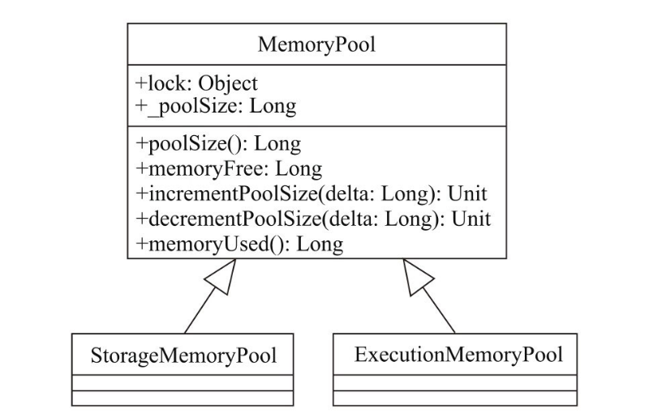
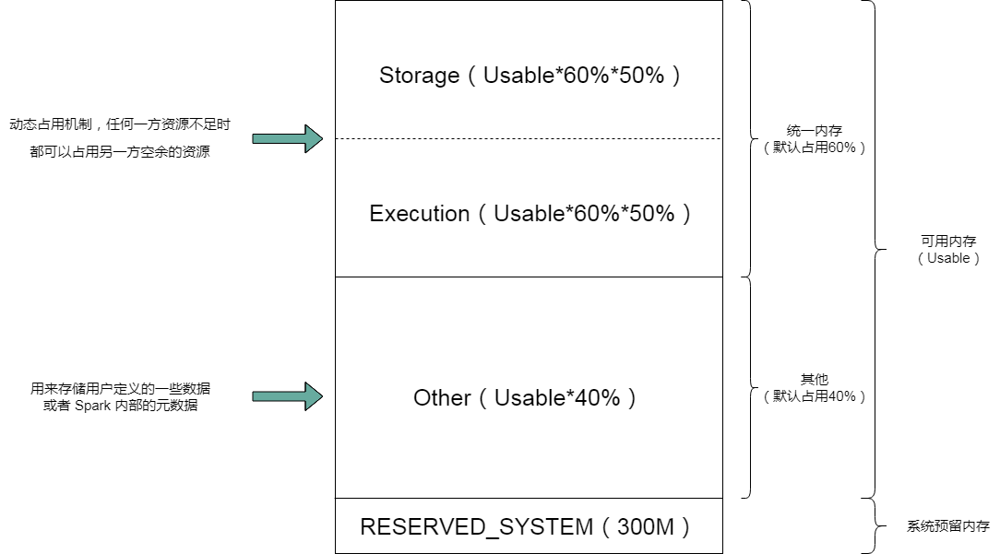

> 专栏原创出处：[github-源笔记文件 ](https://github.com/GourdErwa/review-notes/tree/master/framework/spark-basis) ，[github-源码 ](https://github.com/GourdErwa/spark-advanced)，欢迎 Star，转载请附上原文出处链接和本声明。

[toc]
## Spark 内存的划分
Spark 的内存除了用作计算资源之外，还将内存的一部分用作存储资源，Spark 使用 MemoryManager 对内存进行统一的管理。
* Spark 在 MemoryMode 定义了两种内存类型，堆内存和堆外内存：ON_HEAP 和 OFF_HEAP。

* Spark 定义了一个抽象类 MemoryPool 对内存进行管理，它需要一个保证线程安全的锁对象 lock，还有一个成员属性就是内存池的大小 _poolSize。该抽象类还定义了一些方法：获取内存池的大小、获取已用内存的大小、获取空余内存的大小、为内存池扩展指定 delta 大小的空间(delta 必须为正整数)、将内存池缩小指定大小 delta 的空间(delta 必须为正整数，且缩小后的空间大小要大于已经使用的空间大小)。

* MemoryPool 有两个实现类，一个为存储体系服务，另一个为计算引擎服务。

    
    
内存池继承体系

### ON_HEAP 内存划分
* 首先预留出一部分系统空间 RESERVED_SYSTEM_MEMORY_BYTES，该内存大小默认为 300M。

* 剩余的也就是可用内存，可用内存默认的 60% 被用做统一内存，也就是 Storage 和 Execution，剩余的 40% 用来存储用户定义的一些数据或者 Spark 内部的元数据。二者的比例由 spark.memory.fraction 来控制，默认是 0.6。

* 统一内存默认被一分为二，一半用来缓存数据，也就是 StorageMemory，另一半为计算提供支持，用来缓存 Shuffle 过程产生的中间数据，也就是 ExecutionMemory。二者的比例由 spark.memory.storageFraction 来控制，默认是0.5。

* StorageMemory 和 ExecutionMemory 存在动态占用的机制，任何一方资源不足时都可以占用另一方空余的资源。

* 当 Storage 占用了 Execution 的资源后，如果 Execution 需要更多的计算资源，会将 Storage 所占用的资源强行回收；相反，如果 Execution 占用了 Storage 的资源后，Storage 需要更多的存储资源时，无法强行回收 Execution 占用的资源。

    
    
ON_HEAP内存划分

### OFF_HEAP 简介
Spark 中 RDD 提供了多种存储级别，除去使用内存，磁盘等，还有一种是 OFF_HEAP，又称为 JVM 堆外内存。
* OFF_HEAP 的优势在于，在内存有限时，可以减少频繁 GC 及不必要的内存消耗，提升程序性能。

* OFF_HEAP 的缺点是没有数据备份，也不能保证数据高可用，丢失数据则需要重新计算。